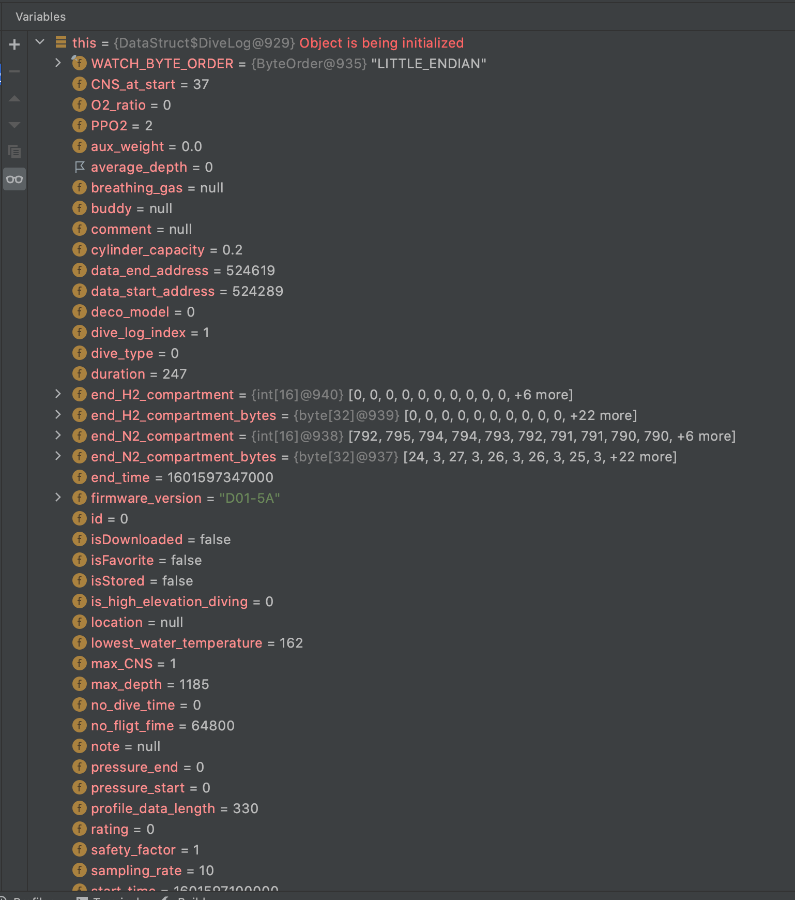
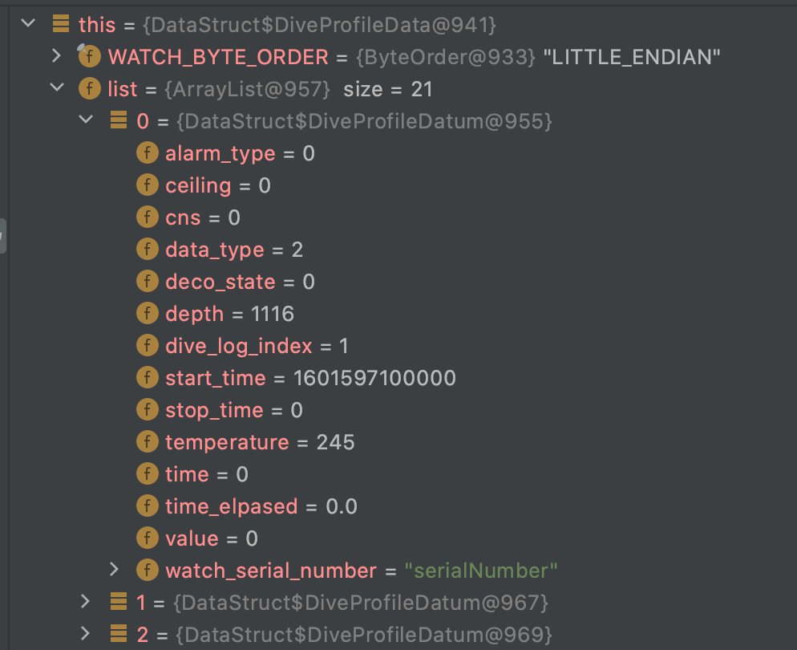
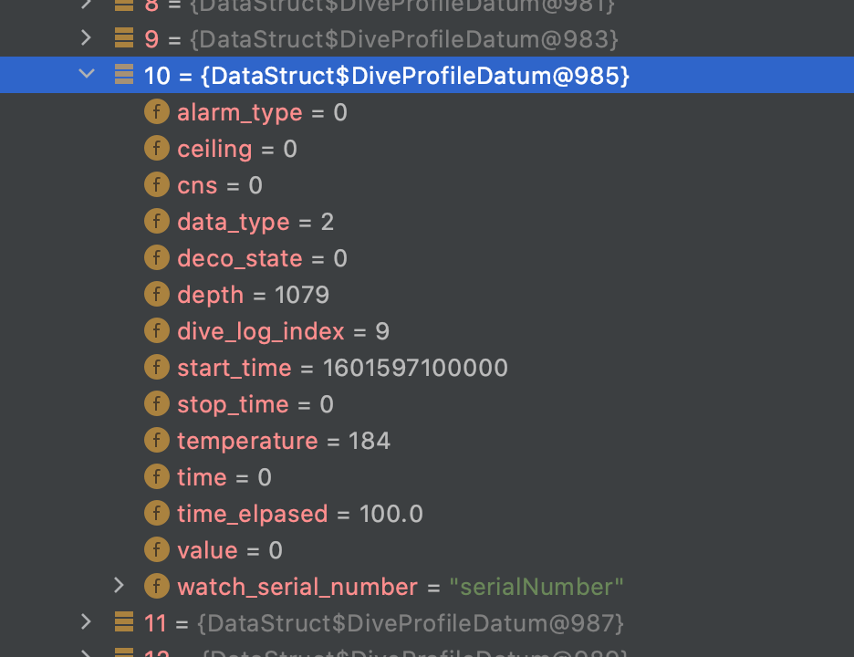
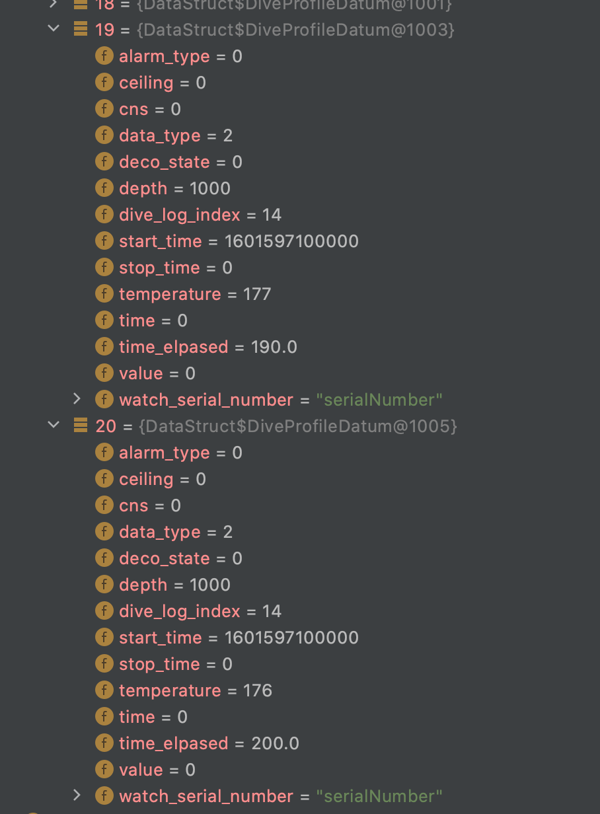

Dive Byte Parser
====
This simple java program exists to take the pieces from the 
HCI logs and run them through the "same code" as the Android app
(as closely as the decompiler could get to it, at least)

_This is not intended to be a polished application - just something
quick and dirty that can be run inside an IDE and stepped-through / debugged
to observe how the packets are parsed._

This makes it easier to re-implement this and know what values
should be expected. 

Usage: 
Take the HCI packet and strip out the internal header stuff and checksum

First program argument - the "dive log" response: 
Second argument - a "dive profile" response:

Here are two examples: 
```
01000000000000004a010000140a011405240000f70000000a000000a1040000a200000000000000010008004b0108004430312d35410000e803000000000000010000000200000025000000010000000000000018031b031a031a03190318031703170316031603160316031603160316031603000000000000000000000000000000000000000000000000000000000000000020fd000000000000 02ff5c04f50002ff9a04e60002ff7e04db0002ff3b04d20002ff7b04cb0002ff6604c60002fe1804c10002fe7b04be0002fe8c04bb0002fe5604b90002fe3704b80002fed603b70002fd4b04b60002fd6a04b50002fd4c04b40002fd2a04b30002fdf503b30002fdd703b30002fcd703b20002fcd803b10002fcd603b00002fc

```

What the dive log looks like when parsed: 
----


What the Dive Profiles look like when parsed:
----
Examples of how it looks parsed out:

Another example:

Yet another example:


